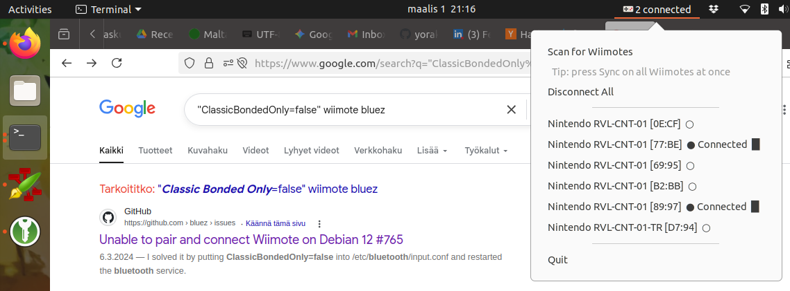

# WiimoteManager

Linux Wiimote manager leveraging the hid-wiimote kernel driver, with automatic pairing, player-LED assignment, and a GTK3 system tray interface.

This was created as an example and experiment for using Claude to generate a small purpose built tool. Scratch an itch.



---

## Features

- Auto-pairs and connects any Wiimote discovered while scanning (press 1+2 or the red Sync button in the battery compartment)
- Assigns player-number LEDs automatically (supports up to 10 simultaneous controllers using single, pair, triplet, and all-four LED patterns)
- Turns LEDs off on disconnect and re-assigns on reconnect
- Shows battery level in the tray menu
- Desktop notifications on connect, disconnect, and error
- `wiimote_manager.py` is a standalone module — use it without the tray

## Requirements

```
python3-dbus
gir1.2-gtk-3.0
gir1.2-appindicator3-0.1
gir1.2-notify-0.7
gnome-shell-extension-appindicator  (or equivalent)
```

The `hid-wiimote` kernel module must be loaded (it is included in the mainline kernel).
Optionally, [hid-wiimote-plus](https://github.com/dkosmari/hid-wiimote-plus) can be used
as a drop-in replacement. It fixes several input mapping issues in the mainline driver:
correct `BTN_DPAD_*` mappings for the D-pad (instead of keyboard arrows), proper
`BTN_START`/`BTN_SELECT` for plus/minus, corrected stick and accelerometer axes, and
accurate button layout for attachments. It installs via DKMS and is otherwise transparent
to this manager.

## Setup

**BlueZ 5.73+** — since BlueZ 5.73 the input plugin rejects Wiimote connections
by default. Add this to `/etc/bluetooth/input.conf` and restart Bluetooth:

```ini
[General]
ClassicBondedOnly=false
```

**LED permissions** — the kernel restricts write access to Wiimote LED sysfs nodes.
Run the included script to check and apply the udev fix:

```bash
bash check_and_fix_led_permissions.sh
```

The script handles both the LED udev rule and the BlueZ input.conf setting.
For a full explanation of why standard `MODE="0666"` udev rules do not work for
sysfs LED devices, see [readme_on_udev_leds.md](readme_on_udev_leds.md).

## Usage

```bash
python3 wiimote_tray.py
```

The tray icon appears in the system tray. Click **Scan for Wiimotes**, then press 1+2 (or Sync) on each controller. Connected Wiimotes appear in the menu; click one to disconnect it.

## Credits

Code created with [Claude Code](https://claude.ai/claude-code) by Anthropic.
